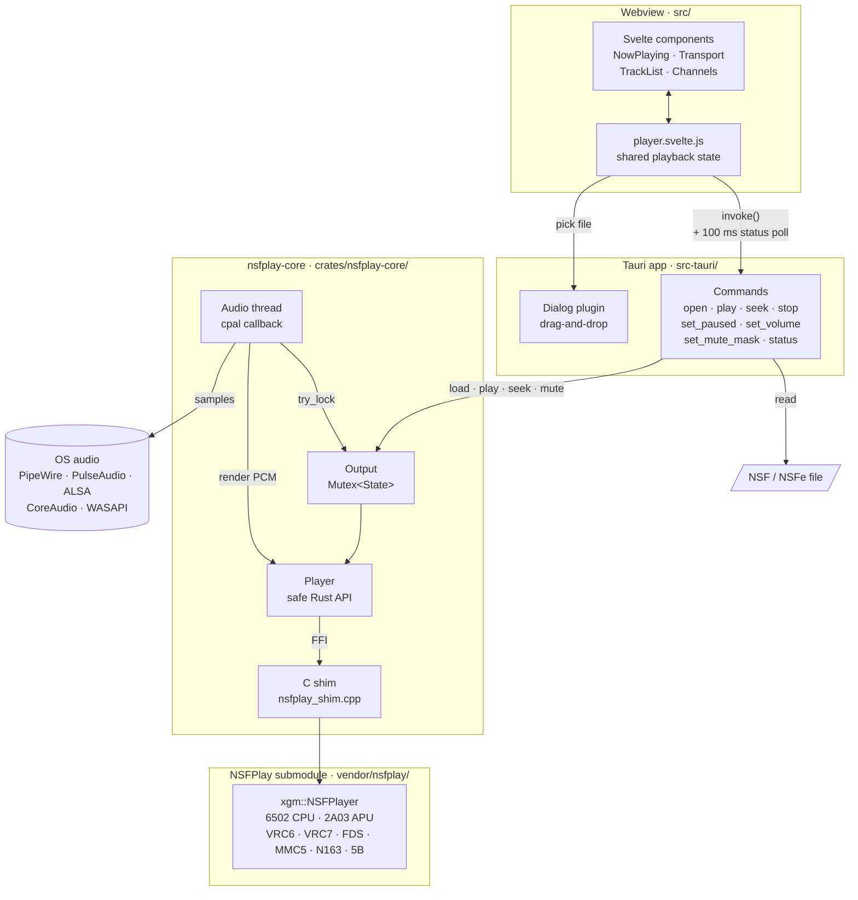

# NSFDeck

A cross-platform player for NES Sound Format (NSF/NSFe) files, for Linux, macOS and
Windows. It's built with [Tauri](https://tauri.app) and [Svelte](https://svelte.dev), and
plays music through the emulation core of
[NSFPlay](https://github.com/bbbradsmith/nsfplay), which is included as a git submodule.

Features: open or drag in NSF/NSFe files, track list, play/pause/stop/prev/next,
seeking, volume, file metadata, and per-channel mute/solo.

Keyboard: Space play/pause · ↑/↓ previous/next track · ←/→ seek 5 s · Ctrl+O open.

## Architecture

The UI never handles audio. Commands change the shared `Output` state, and cpal's
realtime callback renders samples from the emulator on its own thread. That callback
only uses `try_lock`, so a slow command such as a long seek produces a moment of
silence rather than a stalled audio thread.

## Building

Requirements: [Rust](https://rustup.rs), Node.js with [pnpm](https://pnpm.io), a C++17 compiler, and the
[Tauri system dependencies](https://v2.tauri.app/start/prerequisites/). On Debian/Ubuntu:

    sudo apt install libwebkit2gtk-4.1-dev build-essential libssl-dev \
        libayatana-appindicator3-dev librsvg2-dev libasound2-dev

Then:

    git submodule update --init   # fetch NSFPlay into vendor/nsfplay (or clone with --recursive)
    pnpm install
    pnpm tauri dev                # run with hot reload
    pnpm tauri build              # build installers into target/release/bundle/

## Layout

| Path | Contents |
|---|---|
| `vendor/nsfplay/` | Upstream NSFPlay (submodule). Only its `xgm/` and `vcm/` emulation core is compiled. |
| `crates/nsfplay-core/` | Rust crate that compiles the core, wraps it through a small C shim (`shim/`), and plays audio with [cpal](https://github.com/RustAudio/cpal) behind the `output` feature. It does not depend on Tauri. |
| `src-tauri/` | The Tauri app: window setup and the commands the UI calls. |
| `src/` | The Svelte 5 frontend. `lib/player.svelte.js` holds playback state; `lib/components/` holds the UI. |

The core crate can be tested and run on its own:

    cargo test -p nsfplay-core
    cargo run -p nsfplay-core --features output --example play -- FILE.nsf [TRACK] [SECONDS]

## Updating NSFPlay

    cd vendor/nsfplay && git fetch && git checkout <commit-or-tag> && cd ../..
    cargo test -p nsfplay-core
    git commit -am "Update NSFPlay"

If upstream adds or removes core source files, update the lists in
`crates/nsfplay-core/build.rs`, which mirror NSFPlay's `contrib/Makefile`.

## License

NSFDeck is released under the [MIT License](LICENSE). The bundled NSFPlay emulation core has its own
permissive terms; see [THIRD_PARTY_NOTICES.md](THIRD_PARTY_NOTICES.md).
